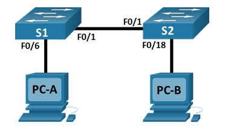

# Лабораторная работа. Просмотр таблицы MAC-адресов коммутатора.

## Топология:


## Таблица адресации:

|   Устройство   |   Интерфейс   |   IP-адрес        |   Маска подсети  |
|  ------------  |  -----------  |  --------------   | -----------------|
|   S1           |   VLAN 1      |   192.168.1.11    |  255.255.255.0   |      
|   S2           |   VLAN 1      |   192.168.1.12    |  255.255.255.0   |
|   PC-A         |   NIC         |   192.168.1.1     |  255.255.255.0   |
|   PC-B         |   NIC         |   192.168.1.2     |  255.255.255.0   |

## Цели:

### Часть 1. Создание и настройка сети.

### Часть 2. Изучение таблицы МАС-адресов коммутатора.

## Решение:

### Часть 1. Создание и настройка сети/

Шаг 1. Создадим сеть согласно топологии в Cisco Packet Tracer.

Шаг 2. Настроим узлы ПК. Присвоим имена и ip-адреса согласно таблице.

Шаг 3. Настроим базовые параметры каждого коммутатора:

S1:

```
Switch>en
Switch#conf t
Switch(config)#hostname S1
S1(config)#int vlan 1
S1(config-if)#ip address 192.168.1.11 255.255.255.0
S1(config-if)#no sh
%LINEPROTO-5-UPDOWN: Line protocol on Interface Vlan1, changed state to up
S1(config-if)#exit
S1(config)#line con 0
S1(config-line)#password cisco
S1(config-line)#login
S1(config-line)#exit
S1(config)#line vty 0 4
S1(config-line)#password cisco
S1(config-line)#login
S1(config-line)#exit
S1(config)#enable secret class
S1(config)#service password-encryption 
S1(config)#exit
S1#copy run sta
Destination filename [startup-config]? 
Building configuration...
[OK]
```

S2

```
Switch>en
Switch#conf t
Switch(config)#hostname S2
S1(config)#int vlan 1
S1(config-if)#ip address 192.168.1.12 255.255.255.0
S1(config-if)#no sh
%LINEPROTO-5-UPDOWN: Line protocol on Interface Vlan1, changed state to up
S1(config-if)#exit
S1(config)#line con 0
S1(config-line)#password cisco
S1(config-line)#login
S1(config-line)#exit
S1(config)#line vty 0 4
S1(config-line)#password cisco
S1(config-line)#login
S1(config-line)#exit
S1(config)#enable secret class
S1(config)#service password-encryption 
S1(config)#exit
S1#copy run sta
Destination filename [startup-config]? 
Building configuration...
[OK]
```

### Часть 2. Изучение таблицы МАС-адресов коммутатора

Шаг 1. Запишем МАС-адреса сетевых устройств

* a) Для каждого ПК в командной строке выполним команду ipconfig /all.

  MAC-адрес компьютера PC-A: 0090.0CBA.696E

  MAC-адрес компьютера PC-B: 0006.2AD2.AE07

* b.)	Подключимся к коммутаторам S1 и S2 через консоль и введите команду show interface F0/1 на каждом.

  МАС-адрес коммутатора S1 Fast Ethernet 0/1: 0002.1670.4101

  МАС-адрес коммутатора S1 Fast Ethernet 0/2: 0060.708c.ac01

Шаг 2. Просмотр таблицs МАС-адресов коммутатора.

* a.)	Подключимся к коммутатору S2 через консоль и войдем в привилегированный режим EXEC.

* b.)	В привилегированном режиме EXEC введите команду show mac address-table.

```
S2>en
Password: 
S2#show mac address-ta
S2#show mac address-table 
          Mac Address Table
-------------------------------------------

Vlan    Mac Address       Type        Ports
----    -----------       --------    -----

   1    0002.1670.4101    DYNAMIC     Fa0/1
```

Мы наблюдаем всего одну запись.

Mac-адрес принадлежит коммутатора S1, на который мы попадаем через порт Fa0/1.

Если мы выполним ICMP запросы с коммутаторы S2 к ПК PC-A и PC-B, то таблица MAC-адресов примет вид:

```
S2#show mac address-table 
          Mac Address Table
-------------------------------------------

Vlan    Mac Address       Type        Ports
----    -----------       --------    -----

   1    0002.1670.4101    DYNAMIC     Fa0/1
   1    0006.2ad2.ae07    DYNAMIC     Fa0/18
   1    0090.0cba.696e    DYNAMIC     Fa0/1
```

Из таблицы становится понятно, MAC-адрес компьютера PC-B находится за портом Fa0/18, а PC-A за портом Fa0/1.

Шаг 3. Очистим таблицу МАС-адресов коммутатора S2 и снова отобразим таблицу МАС-адресов.

```
S2#clear mac address-table dynamic
S2#show mac address-table 
          Mac Address Table
-------------------------------------------

Vlan    Mac Address       Type        Ports
----    -----------       --------    -----

S2#show mac address-table 
          Mac Address Table
-------------------------------------------

Vlan    Mac Address       Type        Ports
----    -----------       --------    -----

   1    0002.1670.4101    DYNAMIC     Fa0/1
```

После очистки таблицы MAC-адресов никаких данных нет.

Спустя время появляется запись адреса и порта коммутатора S1.

Шаг 4. С компьютера PC-B отправим эхо-запросы устройствам в сети и просмотрим таблицу МАС-адресов коммутатора.

* a.)	На компьютере PC-B откроем командную строку и еще раз введите команду arp -a.

```
C:\>arp -a
  Internet Address      Physical Address      Type
  192.168.1.1           0090.0cba.696e        dynamic
  192.168.1.11          00e0.b0bb.51ae        dynamic
  192.168.1.12          0060.3e53.e06a        dynamic
```

Мы наблюдаем 3 пары адресов (MAC + IP), которые принадлежат ПК и коммутаторам.

* b.)	Из командной строки PC-B отправим (ранее уже делал) эхо-запросы на компьютер PC-A, а также коммутаторы S1 и S2.

  От всех устройств успешно получены ответы.

* c.)	Подключившись через консоль к коммутатору S2, введем команду show mac address-table.

```
S2>show mac address-table 
          Mac Address Table
-------------------------------------------

Vlan    Mac Address       Type        Ports
----    -----------       --------    -----

   1    0002.1670.4101    DYNAMIC     Fa0/1
   1    0006.2ad2.ae07    DYNAMIC     Fa0/18
   1    00e0.b0bb.51ae    DYNAMIC     Fa0/1
```

В пункте 2 я уже выполнил ICMP запросы и к ПК, и к коммутаторам, поэтому новых записей в таблицах нет.

Аналогично на ПК PC-B arp-таблица не меняется. запросы были выполнены ранее.


  
   

  
