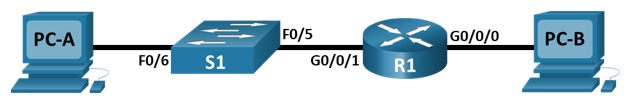

# Лабораторная работа. Настройка IPv6-адресов на сетевых устройствах

## Топология:


## Таблица адресации:

|   Устройство   |   Интерфейс   |   IPv6-адрес        |   Link local IPv6-адрес  |  Длина префикса   |  Шлюз по умолчанию   |
|  ------------  |  -----------  |  ----------------   | -------------------------|  ---------------- |  -----------------   |
|  R1            |  G0/0/0       |  2001:db8:acad:a::1 |   fe80::1                |  64               |    -                 |
|  R1            |  G0/0/1       |  2001:db8:acad:1::1 |   fe80::1                |  64               |    -                 |
|  S1            |  VLAN 1       |  2001:db8:acad:1::b |   fe80::b                |  64               |    -                 |
|  PC-A          |  NIC          |  2001:db8:acad:1::3 |   SLACC                  |  64               |    fe80::1           |
|  PC-B          |  NIC          |  2001:db8:acad:a::3 |   SLACC                  |  64               |    fe80::1           |

## Задачи:

### Часть 1. Настройка топологии и конфигурация основных параметров маршрутизатора и коммутатора.

### Часть 2. Ручная настройка IPv6-адресов.

### Часть 3. Проверка сквозного соединения.

## Решение:

### Часть 1. Настройка топологии и конфигурация основных параметров маршрутизатора и коммутатора.

Построим сеть согласно топологии в Cisco Packet Tracer.

Шаг 1. Настроим маршрутизатор.

Назначим имя хоста и настроим основные параметры устройства.

```
Router>en
Router#conf t
Router(config)#hostname R1
R1(config)#enable secret class
R1(config)#service password-encryption
R1(config)#line con 0
R1(config-line)#password cisco
R1(config-line)#login
R1(config-line)#line vty 0 4
R1(config-line)#password cisco
R1(config-line)#login
R1(config-line)#end
R1#copy run sta
Destination filename [startup-config]? 
Building configuration...
[OK]
```
