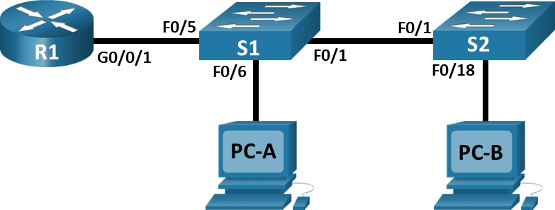

# Лабораторная работа. Внедрение маршрутизации между виртуальными локальными сетями.

## Топология:


## Таблица адресации:

|   Устройство   |   Интерфейс   |   IP-адрес        |   Маска подсети  |    Шлюз по умолчанию  |           
|  ------------  |  -----------  |  --------------   | -----------------|  -------------------- |
|   R1           |   G0/0/1.10   |   192.168.10.1    |  255.255.255.0   |  --                   |
|                |   G0/0/1.20   |   192.168.20.1    |  255.255.255.0   |  --                   |
|                |   G0/0/1.30   |   192.168.30.1    |  255.255.255.0   |  --                   |
|                |   G0/0/1.1000 |   --              |  --              |  --                   |
|   S1           |   VLAN 10     |   192.168.10.11   |  255.255.255.0   |  192.168.10.1         |
|   S2           |   VLAN 10     |   192.168.10.12   |  255.255.255.0   |  192.168.10.1         |
|   PC-A         |   NIC         |   192.168.20.3    |  255.255.255.0   |  192.168.20.1         |
|   PC-B         |   NIC         |   192.168.30.3    |  255.255.255.0   |  192.168.30.1         |

## Таблица VLAN:

|   VLAN         |   Имя         |   Назначенный интерфейс        |    
|  ------------  |  -----------  |  -------------------------     | 
|  10            |  Management   |  S1: VLAN 10, S2: VLAN 10      |
|  20            |  Sales        |  S1: F0/6                      |
|  30            |  Operations   |  S2: F0/18                     |
|  999           |  Parking_Lot  |  S1: F0/2-4, F0/7-24, G0/1-2   |
|  999           |  Parking_Lot  |  S2: F0/2-17, F0/19-24, G0/1-2 |
|  1000          |  Native       |  --                            |

## Задачи:

### Часть 1. Создание сети и настройка основных параметров устройства.

### Часть 2. Создание сетей VLAN и назначение портов коммутатора.

### Часть 3. Настройка транка 802.1Q между коммутаторами.

### Часть 4. Настройка маршрутизации между сетями VLAN.

### Часть 5. Проверка, что маршрутизация между VLAN работает.

## Решение:

### Часть 1. Создание сети и настройка основных параметров устройства.

Шаг 1. Создадим сеть согласно топологии в CISCO Packe Tracert.

Шаг 2. Настроим базовые параметры для маршрутизатора.

```
Router>en
Router#conf t
Router(config)#hostname R1
R1(config)#no ip domain-lookup 
R1(config)#enable secret class
R1(config)#line con 0
R1(config-line)#password cisco
R1(config-line)#login
R1(config)#line vty 0 4
R1(config-line)#password cisco
R1(config-line)#login
R1(config-line)#exit
R1(config)#service password-encryption
R1(config)#banner motd #
Enter TEXT message.  End with the character '#'.
Unauthorized access is strictly prohibited.#
R1#copy run sta
Destination filename [startup-config]? 
Building configuration...
[OK]
R1#clock set 20:24:00 22 sep 2026
```

Шаг 3. Настроим базовые параметры каждого коммутатора.

```
Switch>en
Switch#conf t
Switch(config)#hostname S1
S1(config)#line con 0
S1(config-line)#password cisco
S1(config-line)#login
S1(config-line)#line vty 0 4
S1(config-line)#password cisco
S1(config-line)#login
S1(config-line)#exit
S1(config)#service password-encryption
S1(config)#banner motd #
Enter TEXT message.  End with the character '#'.
Unauthorized access is strictly prohibited.#
S1(config)#exit
S1#clock set 20:31:00 22 sep 2026
S1#copy run sta
Destination filename [startup-config]? 
Building configuration...
[OK]
```

```
Switch>en
Switch#conf t
Switch(config)#hostname S2
S2(config)#line con 0
S2(config-line)#password cisco
S2(config-line)#login
S2(config-line)#line vty 0 4
S2(config-line)#password cisco
S2(config-line)#login
S2(config-line)#exit
S2(config)#service password-encryption
S2(config)#banner motd #
Enter TEXT message.  End with the character '#'.
Unauthorized access is strictly prohibited.#
S2(config)#exit
S2#clock set 20:31:00 22 sep 2026
S2#copy run sta
Destination filename [startup-config]? 
Building configuration...
[OK]
```
Шаг 4. Настроим узлы ПК.

### Часть 2. Создание сетей VLAN и назначение портов коммутатора.

Шаг 1. Создадим сети VLAN на коммутаторах.

* a)	Создадим и назовем необходимые VLAN на каждом коммутаторе из таблицы выше.

```
S1(config)#vlan 10
S1(config-vlan)#name Management
S1(config-vlan)#vlan 20
S1(config-vlan)#name Sales
S1(config-vlan)#vlan 30
S1(config-vlan)#name Operations
S1(config-vlan)#vlan 999
S1(config-vlan)#name Parking_Lot
S1(config-vlan)#vlan 1000
S1(config-vlan)#name Native
```

```
S2(config)#vlan 10
S2(config-vlan)#name Management
S2(config-vlan)#vlan 20
S2(config-vlan)#name Sales
S2(config-vlan)#vlan 30
S2(config-vlan)#name Operations
S2(config-vlan)#vlan 999
S2(config-vlan)#name Parking_Lot
S2(config-vlan)#vlan 1000
S2(config-vlan)#name Native
```

* b)	Настроим интерфейс управления и шлюз по умолчанию на каждом коммутаторе, используя информацию об IP-адресе в таблице адресации.

```
S1(config)#int vlan 10
S1(config-if)#ip address 192.168.10.11 255.255.255.0
S1(config-if)#exit
S1(config)#ip default-gateway 192.168.10.1
``` 

```
S2(config)#int vlan 10
S2(config-if)#ip address 192.168.10.12 255.255.255.0
S2(config-if)#exit
S2(config)#ip default-gateway 192.168.10.1
```

* c)	Назначим все неиспользуемые порты коммутатора VLAN Parking_Lot, настроим их для статического режима доступа и административно деактивируем их.

```
S1(config)#int range f0/2-4,f0/7-24,g0/1-2
S1(config-if-range)#switchport mode access
S1(config-if-range)#switchport access vlan 999
```

```
S2(config)#int range f0/2-17, f0/19-24, G0/1-2
S2(config-if-range)#switchport mode access
S2(config-if-range)#switchport access vlan 999
```

Шаг 2. Назначим сети VLAN соответствующим интерфейсам коммутатора.

* a)	Назначим используемые порты соответствующей VLAN (указанной в таблице VLAN выше) и настроим их для режима статического доступа.

```
S1(config)#int f0/6
S1(config-if)#switchport mode access
S1(config-if)#switchport access vlan 20
```

```
S2(config)#int f0/18
S2(config-if)#switchport mode access
S2(config-if)#switchport access vlan 30
```

* b)	Убедимся, что VLAN назначены на правильные интерфейсы.

```
S1#sh vlan br

VLAN Name                             Status    Ports
---- -------------------------------- --------- -------------------------------
1    default                          active    Fa0/1, Fa0/5
10   Management                       active    
20   Sales                            active    Fa0/6
30   Operations                       active    
999  Parking_Lot                      active    Fa0/2, Fa0/3, Fa0/4, Fa0/7
                                                Fa0/8, Fa0/9, Fa0/10, Fa0/11
                                                Fa0/12, Fa0/13, Fa0/14, Fa0/15
                                                Fa0/16, Fa0/17, Fa0/18, Fa0/19
                                                Fa0/20, Fa0/21, Fa0/22, Fa0/23
                                                Fa0/24, Gig0/1, Gig0/2
```

```
S2#sh vlan br

VLAN Name                             Status    Ports
---- -------------------------------- --------- -------------------------------
1    default                          active    Fa0/1
10   Management                       active    
20   Sales                            active    
30   Operations                       active    Fa0/18
999  Parking_Lot                      active    Fa0/2, Fa0/3, Fa0/4, Fa0/5
                                                Fa0/6, Fa0/7, Fa0/8, Fa0/9
                                                Fa0/10, Fa0/11, Fa0/12, Fa0/13
                                                Fa0/14, Fa0/15, Fa0/16, Fa0/17
                                                Fa0/19, Fa0/20, Fa0/21, Fa0/22
                                                Fa0/23, Fa0/24, Gig0/1, Gig0/2
```

### Часть 3. Настройка транка 802.1Q между коммутаторами.

Шаг 1. Вручную настроим магистральный интерфейс F0/1 на коммутаторах S1 и S2.

```
S1(config)#int f0/1
S1(config-if)#switchport mode trunk
S1(config-if)#switchport trunk native vlan 1000
S1(config-if)#switchport trunk allowed vlan 10,20,30,1000
S1#sh interfaces f0/1 switchport 
Name: Fa0/1
Switchport: Enabled
Administrative Mode: trunk
Operational Mode: trunk
Administrative Trunking Encapsulation: dot1q
Operational Trunking Encapsulation: dot1q
Negotiation of Trunking: On
Access Mode VLAN: 1 (default)
Trunking Native Mode VLAN: 1000 (Native)
Voice VLAN: none
Administrative private-vlan host-association: none
Administrative private-vlan mapping: none
Administrative private-vlan trunk native VLAN: none
Administrative private-vlan trunk encapsulation: dot1q
Administrative private-vlan trunk normal VLANs: none
Administrative private-vlan trunk private VLANs: none
Operational private-vlan: none
Trunking VLANs Enabled: 10,20,30,1000
Pruning VLANs Enabled: 2-1001
Capture Mode Disabled
Capture VLANs Allowed: ALL
Protected: false
Unknown unicast blocked: disabled
Unknown multicast blocked: disabled
Appliance trust: none
```

```
S2(config)#int f0/1
S2(config-if)#switchport mode trunk
S2(config-if)#switchport trunk native vlan 1000
S2(config-if)#switchport trunk allowed vlan 10,20,30,1000
S2#sh int f0/1 switchport 
Name: Fa0/1
Switchport: Enabled
Administrative Mode: trunk
Operational Mode: trunk
Administrative Trunking Encapsulation: dot1q
Operational Trunking Encapsulation: dot1q
Negotiation of Trunking: On
Access Mode VLAN: 1 (default)
Trunking Native Mode VLAN: 1000 (Native)
Voice VLAN: none
Administrative private-vlan host-association: none
Administrative private-vlan mapping: none
Administrative private-vlan trunk native VLAN: none
Administrative private-vlan trunk encapsulation: dot1q
Administrative private-vlan trunk normal VLANs: none
Administrative private-vlan trunk private VLANs: none
Operational private-vlan: none
Trunking VLANs Enabled: 10,20,30,1000
Pruning VLANs Enabled: 2-1001
Capture Mode Disabled
Capture VLANs Allowed: ALL
Protected: false
Unknown unicast blocked: disabled
Unknown multicast blocked: disabled
Appliance trust: none
```

Шаг 2. Вручную настроим магистральный интерфейс F0/5 на коммутаторе S1.

```
S1(config)#int f0/5
S1(config-if)#switchport mode trunk
S1(config-if)#switchport trunk native vlan 1000
S1(config-if)#switchport trunk allowed vlan 10,20,30,1000
S1(config-if)#end
S1#copy run sta
Destination filename [startup-config]? 
Building configuration...
[OK]
```

### Часть 4. Настройка маршрутизации между сетями VLAN.

Шаг 1. Настроим маршрутизатор.

```
R1(config)#int g0/0/1.10
R1(config-subif)#encapsulation dot1Q 10
R1(config-subif)#ip address 192.168.10.1 255.255.255.0
R1(config-subif)#int g0/0/1.20
R1(config-subif)#encapsulation dot1Q 20
R1(config-subif)#ip address 192.168.20.1 255.255.255.0
R1(config-subif)#int g0/0/1.30
R1(config-subif)#encapsulation dot1Q 30
R1(config-subif)#ip address 192.168.30.1 255.255.255.0
R1(config-subif)#int G0/0/1.1000
R1(config-subif)#encapsulation dot1Q 1000 native
R1(config-subif)#exit
R1(config)#int g0/0/1
R1(config-if)#no sh
```

### Часть 5. Проверим, что маршрутизация между VLAN работает.

Шаг 1. Выполним следующие тесты с PC-A.

* a)	Отправим эхо-запрос с PC-A на шлюз по умолчанию.

```
C:\>ping 192.168.20.1

Pinging 192.168.20.1 with 32 bytes of data:

Reply from 192.168.20.1: bytes=32 time<1ms TTL=255
Reply from 192.168.20.1: bytes=32 time<1ms TTL=255
Reply from 192.168.20.1: bytes=32 time<1ms TTL=255
Reply from 192.168.20.1: bytes=32 time<1ms TTL=255

Ping statistics for 192.168.20.1:
    Packets: Sent = 4, Received = 4, Lost = 0 (0% loss),
Approximate round trip times in milli-seconds:
    Minimum = 0ms, Maximum = 0ms, Average = 0ms
```

* b)	Отправим эхо-запрос с PC-A на PC-B.

```
C:\>ping 192.168.30.3

Pinging 192.168.30.3 with 32 bytes of data:

Reply from 192.168.30.3: bytes=32 time<1ms TTL=127
Reply from 192.168.30.3: bytes=32 time<1ms TTL=127
Reply from 192.168.30.3: bytes=32 time=5ms TTL=127
Reply from 192.168.30.3: bytes=32 time<1ms TTL=127

Ping statistics for 192.168.30.3:
    Packets: Sent = 4, Received = 4, Lost = 0 (0% loss),
Approximate round trip times in milli-seconds:
    Minimum = 0ms, Maximum = 5ms, Average = 1ms
```

* c)	Отправим команду ping с компьютера PC-A на коммутатор S2

```
C:\>ping 192.168.10.12

Pinging 192.168.10.12 with 32 bytes of data:

Reply from 192.168.10.12: bytes=32 time<1ms TTL=254
Reply from 192.168.10.12: bytes=32 time<1ms TTL=254
Reply from 192.168.10.12: bytes=32 time=1ms TTL=254
Reply from 192.168.10.12: bytes=32 time<1ms TTL=254

Ping statistics for 192.168.10.12:
    Packets: Sent = 4, Received = 4, Lost = 0 (0% loss),
Approximate round trip times in milli-seconds:
    Minimum = 0ms, Maximum = 1ms, Average = 0ms
```

Шаг 2. Пройдем следующий тест с PC-B

В окне командной строки на PC-B выполним команду tracert на адрес PC-A.

```
C:\>tracert 192.168.20.3

Tracing route to 192.168.20.3 over a maximum of 30 hops: 

  1   0 ms      0 ms      0 ms      192.168.30.1
  2   2 ms      0 ms      0 ms      192.168.20.3

Trace complete.
```


