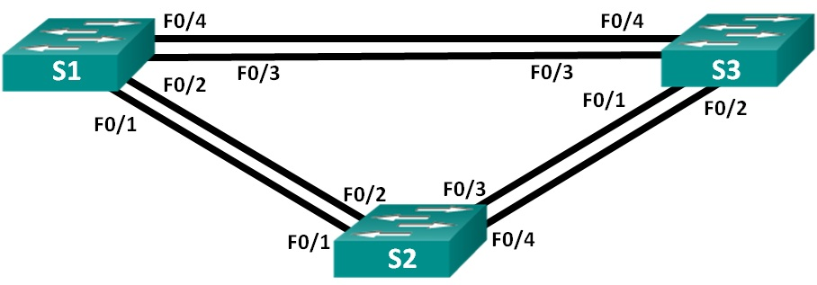

# Лабораторная работа. Развертывание коммутируемой сети с резервными каналами.

## Топология:


## Таблица адресации:

|   Устройство   |   Интерфейс   |   IP-адрес        |   Маска подсети  |
|  ------------  |  -----------  |  --------------   | -----------------|
|   S1           |   VLAN 1      |   192.168.1.1     |  255.255.255.0   |
|   S2           |   VLAN 1      |   192.168.1.2     |  255.255.255.0   |
|   S3           |   VLAN 1      |   192.168.1.3     |  255.255.255.0   |

## Цели:

### Часть 1. Создание сети и настройка основных параметров устройства.

### Часть 2. Выбор корневого моста.

### Часть 3. Наблюдение за процессом выбора протоколом STP порта, исходя из стоимости портов.

### Часть 4. Наблюдение за процессом выбора протоколом STP порта, исходя из приоритета портов.

## Решение:

### Часть 1:	Создание сети и настройка основных параметров устройства.

Шаг 1:	Создайте сеть согласно топологии.

Шаг 2:	Выполните инициализацию и перезагрузку коммутаторов.

Шаг 3:	Настройте базовые параметры каждого коммутатора.

* a)	Отключите поиск DNS.

* b)	Присвойте имена устройствам в соответствии с топологией.

* c)	Назначьте class в качестве зашифрованного пароля доступа к привилегированному режиму.

* d)	Назначьте cisco в качестве паролей консоли и VTY и активируйте вход для консоли и VTY каналов.

* e)	Настройте logging synchronous для консольного канала.

* f)	Настройте баннерное сообщение дня (MOTD) для предупреждения пользователей о запрете несанкционированного доступа.

* g)	Задайте IP-адрес, указанный в таблице адресации для VLAN 1 на всех коммутаторах.
  
* h)	Скопируйте текущую конфигурацию в файл загрузочной конфигурации.

```
Switch>en
Switch#conf t
Switch(config)#no ip domain-lookup
Switch(config)#hostname S1
S1(config)#enable secret class
S1(config)#line con 0
S1(config-line)#password cisco
S1(config-line)#login
S1(config-line)#line vty 0 4
S1(config-line)#password cisco
S1(config-line)#login
S1(config-line)#line con 0
S1(config-line)#logging synchronous 
S1(config-line)#exit
S1(config)#service password-encryption 
S1(config)#banner motd #Authorized Access Only!#
S1(config)#int vlan 1
S1(config-if)#ip address 192.168.1.1 255.255.255.0
S1(config)#end
S1#copy run sta
Destination filename [startup-config]? 
Building configuration...
[OK]
```

```
Switch>en
Switch#conf t
Switch(config)#no ip domain-lookup
Switch(config)#hostname S2
S2(config)#enable secret class
S2(config-line)#line con 0
S2(config-line)#password cisco
S2(config-line)#login
S2(config-line)#logging synchronous 
S2(config-line)#line vty 0 4
S2(config-line)#passwor cisco
S2(config-line)#login
S2(config-line)#exit
S2(config)#service password-encryption 
S2(config)#banner motd #Authorized Access Only!#
S2(config)#int vlan 1
S2(config-if)#ip address 192.168.1.2 255.255.255.0
S2(config-if)#end
S2#copy run sta
Destination filename [startup-config]? 
Building configuration...
[OK]
```

```
Switch>en
Switch#conf t
Switch(config)#no ip domain-lookup
Switch(config)#hostname S3
S3(config)#enable secret class
S3(config)#line con 0
S3(config-line)#password cisco
S3(config-line)#login
S3(config-line)#logging synchronous
S3(config-line)#line vty 0 4
S3(config-line)#passwor cisco
S3(config-line)#login
S3(config-line)#exit
S3(config)#service password-encryption 
S3(config)#banner motd #Authorized Access Only!#
S3(config)#int vlan 1
S3(config-if)#ip address 192.168.1.3 255.255.255.0
S3(config-if)#end
S3#copy run sta
Destination filename [startup-config]? 
Building configuration...
[OK]
```


